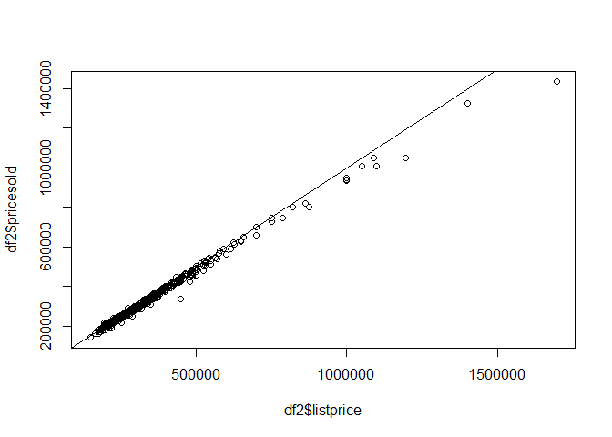
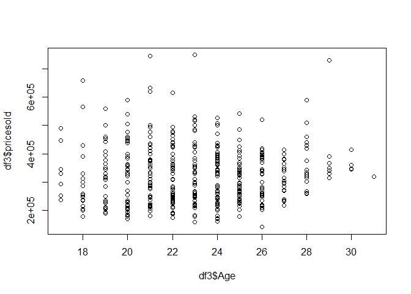
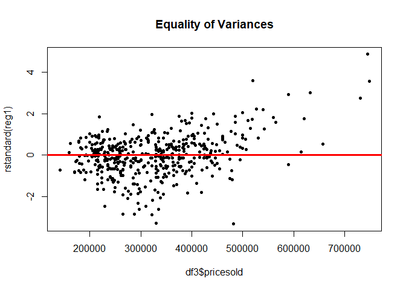
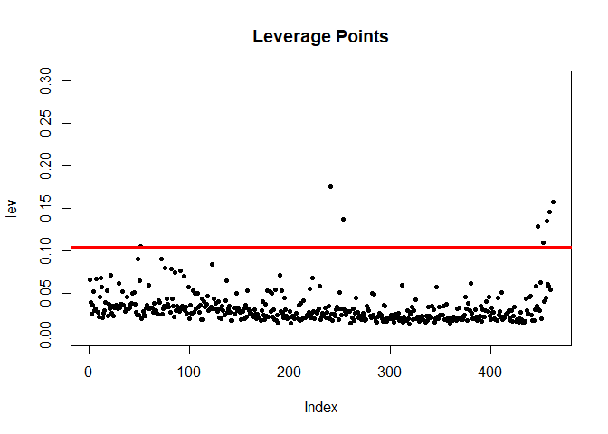

Hunter Homes
================

``` r
library(rio)
library(formattable)
```

    ## Warning: package 'formattable' was built under R version 3.6.3

``` r
library(dplyr)
```

    ## 
    ## Attaching package: 'dplyr'

    ## The following objects are masked from 'package:stats':
    ## 
    ##     filter, lag

    ## The following objects are masked from 'package:base':
    ## 
    ##     intersect, setdiff, setequal, union

``` r
library(tidyverse)
```

    ## Warning: package 'tidyverse' was built under R version 3.6.3

    ## -- Attaching packages ---------------------------------- tidyverse 1.3.0 --

    ## v ggplot2 3.3.3     v purrr   0.3.4
    ## v tibble  3.0.6     v stringr 1.4.0
    ## v tidyr   1.1.2     v forcats 0.4.0
    ## v readr   1.3.1

    ## Warning: package 'ggplot2' was built under R version 3.6.3

    ## Warning: package 'tidyr' was built under R version 3.6.3

    ## Warning: package 'purrr' was built under R version 3.6.3

    ## -- Conflicts ------------------------------------- tidyverse_conflicts() --
    ## x dplyr::filter() masks stats::filter()
    ## x dplyr::lag()    masks stats::lag()

``` r
library(readxl)
library(corrplot)
```

    ## corrplot 0.84 loaded

``` r
library(stargazer)
```

    ## 
    ## Please cite as:

    ##  Hlavac, Marek (2018). stargazer: Well-Formatted Regression and Summary Statistics Tables.

    ##  R package version 5.2.2. https://CRAN.R-project.org/package=stargazer

``` r
library(car)
```

    ## Warning: package 'car' was built under R version 3.6.3

    ## Loading required package: carData

    ## Warning: package 'carData' was built under R version 3.6.3

    ## 
    ## Attaching package: 'car'

    ## The following object is masked from 'package:purrr':
    ## 
    ##     some

    ## The following object is masked from 'package:dplyr':
    ## 
    ##     recode

``` r
library(PerformanceAnalytics)
```

    ## Warning: package 'PerformanceAnalytics' was built under R version 3.6.3

    ## Loading required package: xts

    ## Loading required package: zoo

    ## 
    ## Attaching package: 'zoo'

    ## The following objects are masked from 'package:base':
    ## 
    ##     as.Date, as.Date.numeric

    ## Registered S3 method overwritten by 'xts':
    ##   method     from
    ##   as.zoo.xts zoo

    ## 
    ## Attaching package: 'xts'

    ## The following objects are masked from 'package:dplyr':
    ## 
    ##     first, last

    ## 
    ## Attaching package: 'PerformanceAnalytics'

    ## The following object is masked from 'package:graphics':
    ## 
    ##     legend

``` r
library(tidyr)
library(tm)
```

    ## Warning: package 'tm' was built under R version 3.6.3

    ## Loading required package: NLP

    ## Warning: package 'NLP' was built under R version 3.6.3

    ## 
    ## Attaching package: 'NLP'

    ## The following object is masked from 'package:ggplot2':
    ## 
    ##     annotate

``` r
df<-read_xlsx("HuntersGreenHomeSales.xlsx",sheet = "Data")
```

``` r
colSums(is.na(df))
```

    ##                slnoskm                 Status                Address 
    ##                      0                      0                      0 
    ##                   Beds              bathsfull              bathshalf 
    ##                      0                      0                      0 
    ##             bathstotal                   sqft                garages 
    ##                      0                      0                      4 
    ##                   Roof                lotsqft                  yrblt 
    ##                      0                      0                      0 
    ##                   Pool                    spa                subdivn 
    ##                      0                    313                      0 
    ## adom_agentdaysonmarket      cdom_cumuldaysmls              listprice 
    ##                      0                      0                      0 
    ##              lppersqft            PendingDate              pricesold 
    ##                      0                      0                      0 
    ##              sppersqft               datesold                splsale 
    ##                      0                      0                      0

``` r
df$garages[is.na(df$garages)]<-median(df$garages,na.rm=TRUE)
```

``` r
df2 <- filter(df, Roof == "Shingle"| Roof=="Tile")
df2$Roof<-as.factor(df2$Roof)
summary(df2$Roof)
```

    ## Shingle    Tile 
    ##     239     236

``` r
df2$sellyear<-str_sub(df2$datesold,1,4)
df2$sellyear<-as.double(df2$sellyear)
df2$Age<-df2$sellyear-df2$yrblt
```

``` r
df2$LotUsed<-df2$sqft/df2$lotsqft
plot(df2$LotUsed,df2$pricesold)
```

<!-- -->

``` r
df2$bathstotal<-df2$bathsfull+0.5*(df2$bathshalf)
plot(df2$listprice,df2$pricesold)
abline(0,1)
```

<!-- -->

``` r
df2 <- df2 %>%
  mutate(PoolType = case_when(Pool == "Private" ~ "Private",
                              Pool== "None"~"None",
                              Pool == "Community"~"Community",
                              Pool == "Private, Community"~"Private"))

df2$PoolType<-as.factor(df2$PoolType)
levels(df2$PoolType)
```

    ## [1] "Community" "None"      "Private"

``` r
df2$PoolType<-relevel(df2$PoolType,'None')
```

``` r
boxplot(df2$pricesold)
```

<!-- -->

``` r
boxplot(df2$Beds)
```

<!-- -->

``` r
boxplot(df2$bathstotal)
```

<!-- -->

``` r
boxplot(df2$Age)
```

<!-- -->

``` r
boxplot(df2$lotsqft)
```

<!-- -->

``` r
boxplot(df2$sqft)
```

<!-- -->

``` r
df3 <- df2[ df2$Beds<6 & df2$Age>15 & df2$bathstotal<4.5 & df2$pricesold<800000 & df2$sqft<6000,]
summary(df3$Beds)
```

    ##    Min. 1st Qu.  Median    Mean 3rd Qu.    Max. 
    ##     2.0     3.0     4.0     3.8     4.0     5.0

``` r
boxplot(df3$pricesold)
```

<!-- -->

``` r
boxplot(df3$Beds)
```

<!-- -->

``` r
boxplot(df3$bathstotal)
```

<!-- -->

``` r
boxplot(df3$Age)
```

<!-- -->

``` r
boxplot(df3$lotsqft)
```

<!-- -->

``` r
boxplot(df3$sqft)
```

<!-- -->

``` r
plot(df3$Age,df3$pricesold)
```

<!-- -->

``` r
df3$Street<-removeNumbers(df3$Address) 
df3$Street<-trimws(df3$Street)
n_distinct(df3$Street)
```

    ## [1] 67

``` r
df3$years<-df3$sellyear-2015
```

``` r
school<-c("REGENT SQUARE DR","COURTNEY BREEZE DR","HIGHLAND RIDGE WAY","OSPREY RUN DR","HICKORY MOSS PL","PINE ISLAND CT","WOODRIDGE RUN DR","ASHTON PARK WAY","HAMDEN PARK WAY","HUNTERS PARK WAY","MEADOW LANE CT","REGENT SQUARE DR","HUNTINGTON PARK WAY")

df3 <- df3 %>%
  mutate(School = case_when(Street %in% school ~ 1, TRUE~0))
```

``` r
parkncourt<-c("PARKWAY GREEN LN","RIDGEWAY POINT PL","LONG RIDGE RD","BRAEMAR DR","OAK BRIDGE ST","FAIRMEADOW DR","HUNTERS GREEN DR","HUNTERS POND DR")

df3 <- df3 %>%
  mutate(PNC = case_when(Street %in% parkncourt ~ 1, TRUE~0))
```

``` r
clubs<-c("LONGWATER RUN DR","PINNACLE CT","FAZIO CT")

df3 <- df3 %>%
  mutate(club = case_when(Street %in% clubs ~ 1, TRUE~0))
```

``` r
df3$location<-df3$School+2*df3$club+0.5*df3$PNC
```

``` r
df3$PendingDate<- as.Date(df3$PendingDate)
df3$PendingDate<-format(df3$PendingDate,"%m")
df3$PendingDate<-as.double(df3$PendingDate)
```

``` r
df3 <- df3 %>%
  mutate(quarter = case_when(df3$PendingDate <=3 ~ "1st",
                             df3$PendingDate <=6 & df3$PendingDate>3 ~ "2nd",
                             df3$PendingDate <=9 & df3$PendingDate>6 ~ "3rd",
                             df3$PendingDate <=12 & df3$PendingDate>9 ~ "4th"))
df3$splsale<-as.factor(df3$splsale)
df3$splsale<-relevel(df3$splsale,"None")
df3<-df3%>%
  mutate(splsale = case_when(df3$splsale =="None" ~ "None",
                                df3$splsale!="None"~"Shortsell/Bank"))

df3$splsale<-as.factor(df3$splsale)
df3$splsale<-relevel(df3$splsale,"None")
summary(df3$splsale)
```

    ##           None Shortsell/Bank 
    ##            425             26

``` r
reg1<-lm(formula = pricesold~Beds+bathstotal+sqft+lotsqft+Roof+location+garages+PoolType+years+splsale,data = df3)
options(scipen = 999)
summary(reg1)
```

    ## 
    ## Call:
    ## lm(formula = pricesold ~ Beds + bathstotal + sqft + lotsqft + 
    ##     Roof + location + garages + PoolType + years + splsale, data = df3)
    ## 
    ## Residuals:
    ##     Min      1Q  Median      3Q     Max 
    ## -117879  -19801     620   19897  171178 
    ## 
    ## Coefficients:
    ##                          Estimate  Std. Error t value             Pr(>|t|)
    ## (Intercept)           -35342.9050  13060.0695  -2.706             0.007071
    ## Beds                  -10195.0218   3622.2940  -2.815             0.005105
    ## bathstotal             24778.8026   5684.6181   4.359  0.00001629706850796
    ## sqft                      78.0261      5.2856  14.762 < 0.0000000000000002
    ## lotsqft                    5.1472      0.6226   8.267  0.00000000000000165
    ## RoofTile               14922.4616   4215.8854   3.540             0.000444
    ## location               26347.1230   4125.9069   6.386  0.00000000043483254
    ## garages                12992.5288   4404.2578   2.950             0.003348
    ## PoolTypeCommunity      -3880.8301   6292.6803  -0.617             0.537738
    ## PoolTypePrivate        21459.2093   5351.8866   4.010  0.00007145222655968
    ## years                  12596.6288   1281.2183   9.832 < 0.0000000000000002
    ## splsaleShortsell/Bank -53762.5774   7476.0228  -7.191  0.00000000000278574
    ##                          
    ## (Intercept)           ** 
    ## Beds                  ** 
    ## bathstotal            ***
    ## sqft                  ***
    ## lotsqft               ***
    ## RoofTile              ***
    ## location              ***
    ## garages               ** 
    ## PoolTypeCommunity        
    ## PoolTypePrivate       ***
    ## years                 ***
    ## splsaleShortsell/Bank ***
    ## ---
    ## Signif. codes:  0 '***' 0.001 '**' 0.01 '*' 0.05 '.' 0.1 ' ' 1
    ## 
    ## Residual standard error: 36490 on 439 degrees of freedom
    ## Multiple R-squared:  0.8719, Adjusted R-squared:  0.8687 
    ## F-statistic: 271.7 on 11 and 439 DF,  p-value: < 0.00000000000000022

``` r
#Checking for linearity
plot(reg1$fitted.values,df3$pricesold,pch=1,main="Predicted Values vs Actual Price",ylab = "Predicted Price Sold",xlab = "Actual Price Sold")
abline(0,1,col="red3",lwd=3)
```

<!-- -->

``` r
#checking for normality
qqnorm(reg1$residuals,pch=20,main="Checking for Normality Plot")
qqline(reg1$residuals,lwd=3,col="red3")
```

<!-- -->

``` r
#Checking for equality of variances
plot(df3$pricesold,rstandard(reg1),pch=20,main="Equality of Variances")
abline(0,0,col="red",lwd=3)
```

<!-- -->

``` r
#Checking for leverage points
lev=hat(model.matrix(reg1))
plot(lev,pch=20,ylim=c(0,.3),main="Leverage Points")
abline(3*mean(lev),0,col="red",lwd=3)
```

<!-- -->

``` r
vif1<-vif(reg1)
vif1
```

    ##                GVIF Df GVIF^(1/(2*Df))
    ## Beds       1.774506  1        1.332106
    ## bathstotal 3.006468  1        1.733917
    ## sqft       3.581979  1        1.892612
    ## lotsqft    2.272725  1        1.507556
    ## Roof       1.501428  1        1.225328
    ## location   1.101597  1        1.049570
    ## garages    1.684798  1        1.297998
    ## PoolType   1.604147  2        1.125411
    ## years      1.018341  1        1.009129
    ## splsale    1.028652  1        1.014225

``` r
options(scipen = 999)
```

``` r
reg2<-lm(formula = pricesold~Beds+bathstotal+lotsqft+LotUsed+Roof+location+garages+PoolType+years+splsale,data = df3)
summary(reg2)
```

    ## 
    ## Call:
    ## lm(formula = pricesold ~ Beds + bathstotal + lotsqft + LotUsed + 
    ##     Roof + location + garages + PoolType + years + splsale, data = df3)
    ## 
    ## Residuals:
    ##     Min      1Q  Median      3Q     Max 
    ## -190173  -23230     149   20799  213642 
    ## 
    ## Coefficients:
    ##                           Estimate   Std. Error t value
    ## (Intercept)           -130234.3045   18152.4382  -7.174
    ## Beds                    -3859.7939    4145.3349  -0.931
    ## bathstotal              50178.9517    6059.9404   8.280
    ## lotsqft                    13.3723       0.9427  14.185
    ## LotUsed                330538.8072   43536.0912   7.592
    ## RoofTile                19159.6919    4887.9813   3.920
    ## location                26518.4374    4751.0961   5.582
    ## garages                 19861.4490    5052.6358   3.931
    ## PoolTypeCommunity       -6692.0057    7249.5060  -0.923
    ## PoolTypePrivate         32192.7455    6115.2068   5.264
    ## years                   12829.2654    1473.4287   8.707
    ## splsaleShortsell/Bank  -56905.4937    8616.2826  -6.604
    ##                                   Pr(>|t|)    
    ## (Intercept)            0.00000000000311074 ***
    ## Beds                              0.352305    
    ## bathstotal             0.00000000000000149 ***
    ## lotsqft               < 0.0000000000000002 ***
    ## LotUsed                0.00000000000019061 ***
    ## RoofTile                          0.000103 ***
    ## location               0.00000004180649487 ***
    ## garages                0.00009829995617883 ***
    ## PoolTypeCommunity                 0.356463    
    ## PoolTypePrivate        0.00000022060327479 ***
    ## years                 < 0.0000000000000002 ***
    ## splsaleShortsell/Bank  0.00000000011560066 ***
    ## ---
    ## Signif. codes:  0 '***' 0.001 '**' 0.01 '*' 0.05 '.' 0.1 ' ' 1
    ## 
    ## Residual standard error: 41960 on 439 degrees of freedom
    ## Multiple R-squared:  0.8306, Adjusted R-squared:  0.8264 
    ## F-statistic: 195.7 on 11 and 439 DF,  p-value: < 0.00000000000000022

``` r
#Checking for linearity
plot(reg2$fitted.values,df3$pricesold,pch=1,main="Predicted Values vs Actual Price",ylab = "Predicted Price Sold",xlab = "Actual Price Sold")
abline(0,1,col="red3",lwd=3)
```

<!-- -->

``` r
#checking for normality
qqnorm(reg2$residuals,pch=20,main="Checking for Normality Plot")
qqline(reg2$residuals,lwd=3,col="red3")
```

<!-- -->

``` r
#Checking for equality of variances
plot(df3$pricesold,rstandard(reg2),pch=20,main="Equality of Variances")
abline(0,0,col="red",lwd=3)
```

<!-- -->

``` r
#Checking for leverage points
lev=hat(model.matrix(reg2))
plot(lev,pch=20,ylim=c(0,.3),main="Leverage Points")
abline(3*mean(lev),0,col="red",lwd=3)
```

<!-- -->

``` r
vif2<-vif(reg2)
```

``` r
reg3<-lm(formula = pricesold~Beds+bathstotal+lotsqft+LotUsed+lotsqft*LotUsed+Roof+location+garages+PoolType+splsale+years,data = df3)
summary(reg3)
```

    ## 
    ## Call:
    ## lm(formula = pricesold ~ Beds + bathstotal + lotsqft + LotUsed + 
    ##     lotsqft * LotUsed + Roof + location + garages + PoolType + 
    ##     splsale + years, data = df3)
    ## 
    ## Residuals:
    ##     Min      1Q  Median      3Q     Max 
    ## -116541  -19367     503   19256  171079 
    ## 
    ## Coefficients:
    ##                          Estimate  Std. Error t value             Pr(>|t|)
    ## (Intercept)             -8476.554   18667.524  -0.454             0.649996
    ## Beds                    -9579.048    3622.871  -2.644             0.008486
    ## bathstotal              24155.378    5673.602   4.258     0.00002530984148
    ## lotsqft                     3.144       1.175   2.676             0.007731
    ## LotUsed               -104588.067   52095.179  -2.008             0.045296
    ## RoofTile                13494.052    4261.226   3.167             0.001649
    ## location                26761.163    4116.908   6.500     0.00000000021865
    ## garages                 11812.804    4428.294   2.668             0.007923
    ## PoolTypeCommunity       -2915.359    6289.484  -0.464             0.643215
    ## PoolTypePrivate         19806.561    5396.660   3.670             0.000272
    ## splsaleShortsell/Bank  -52551.813    7474.719  -7.031     0.00000000000794
    ## years                   12616.561    1276.857   9.881 < 0.0000000000000002
    ## lotsqft:LotUsed            88.097       7.274  12.111 < 0.0000000000000002
    ##                          
    ## (Intercept)              
    ## Beds                  ** 
    ## bathstotal            ***
    ## lotsqft               ** 
    ## LotUsed               *  
    ## RoofTile              ** 
    ## location              ***
    ## garages               ** 
    ## PoolTypeCommunity        
    ## PoolTypePrivate       ***
    ## splsaleShortsell/Bank ***
    ## years                 ***
    ## lotsqft:LotUsed       ***
    ## ---
    ## Signif. codes:  0 '***' 0.001 '**' 0.01 '*' 0.05 '.' 0.1 ' ' 1
    ## 
    ## Residual standard error: 36360 on 438 degrees of freedom
    ## Multiple R-squared:  0.8731, Adjusted R-squared:  0.8696 
    ## F-statistic: 251.1 on 12 and 438 DF,  p-value: < 0.00000000000000022

``` r
#Checking for linearity
plot(reg3$fitted.values,df3$pricesold,pch=1,main="Predicted Values vs Actual Price",ylab = "Predicted Price Sold",xlab = "Actual Price Sold")
abline(0,1,col="red3",lwd=3)
```

<!-- -->

``` r
#checking for normality
qqnorm(reg3$residuals,pch=20,main="Checking for Normality Plot")
qqline(reg3$residuals,lwd=3,col="red3")
```

<!-- -->

``` r
#Checking for equality of variances
plot(df3$pricesold,rstandard(reg3),pch=20,main="Equality of Variances")
abline(0,0,col="red",lwd=3)
```

<!-- -->

``` r
#Checking for leverage points
lev=hat(model.matrix(reg3))
plot(lev,pch=20,ylim=c(0,.3),main="Leverage Points")
abline(3*mean(lev),0,col="red",lwd=3)
```

<!-- -->

``` r
vif3<-vif(reg3)
```

``` r
stargazer(reg1,reg2,reg3,type="text",title='Results',align = TRUE,out = "reg.txt")
```

    ## 
    ## Results
    ## ===================================================================================================
    ##                                                    Dependent variable:                             
    ##                       -----------------------------------------------------------------------------
    ##                                                         pricesold                                  
    ##                                  (1)                       (2)                       (3)           
    ## ---------------------------------------------------------------------------------------------------
    ## Beds                       -10,195.020***              -3,859.794               -9,579.048***      
    ##                              (3,622.294)               (4,145.335)               (3,622.871)       
    ##                                                                                                    
    ## bathstotal                  24,778.800***             50,178.950***             24,155.380***      
    ##                              (5,684.618)               (6,059.940)               (5,673.602)       
    ##                                                                                                    
    ## sqft                          78.026***                                                            
    ##                                (5.286)                                                             
    ##                                                                                                    
    ## lotsqft                       5.147***                  13.372***                 3.144***         
    ##                                (0.623)                   (0.943)                   (1.175)         
    ##                                                                                                    
    ## LotUsed                                              330,538.800***            -104,588.100**      
    ##                                                       (43,536.090)              (52,095.180)       
    ##                                                                                                    
    ## RoofTile                    14,922.460***             19,159.690***             13,494.050***      
    ##                              (4,215.885)               (4,887.981)               (4,261.226)       
    ##                                                                                                    
    ## location                    26,347.120***             26,518.440***             26,761.160***      
    ##                              (4,125.907)               (4,751.096)               (4,116.908)       
    ##                                                                                                    
    ## garages                     12,992.530***             19,861.450***             11,812.800***      
    ##                              (4,404.258)               (5,052.636)               (4,428.294)       
    ##                                                                                                    
    ## PoolTypeCommunity            -3,880.830                -6,692.006                -2,915.359        
    ##                              (6,292.680)               (7,249.506)               (6,289.484)       
    ##                                                                                                    
    ## PoolTypePrivate             21,459.210***             32,192.740***             19,806.560***      
    ##                              (5,351.887)               (6,115.207)               (5,396.660)       
    ##                                                                                                    
    ## years                       12,596.630***             12,829.260***             12,616.560***      
    ##                              (1,281.218)               (1,473.429)               (1,276.857)       
    ##                                                                                                    
    ## lotsqft:LotUsed                                                                   88.097***        
    ##                                                                                    (7.274)         
    ##                                                                                                    
    ## splsaleShortsell/Bank      -53,762.580***            -56,905.490***            -52,551.810***      
    ##                              (7,476.023)               (8,616.283)               (7,474.719)       
    ##                                                                                                    
    ## Constant                   -35,342.900***            -130,234.300***             -8,476.554        
    ##                             (13,060.070)              (18,152.440)              (18,667.520)       
    ##                                                                                                    
    ## ---------------------------------------------------------------------------------------------------
    ## Observations                     451                       451                       451           
    ## R2                              0.872                     0.831                     0.873          
    ## Adjusted R2                     0.869                     0.826                     0.870          
    ## Residual Std. Error     36,486.260 (df = 439)     41,962.690 (df = 439)     36,360.970 (df = 438)  
    ## F Statistic           271.734*** (df = 11; 439) 195.699*** (df = 11; 439) 251.145*** (df = 12; 438)
    ## ===================================================================================================
    ## Note:                                                                   *p<0.1; **p<0.05; ***p<0.01

``` r
stargazer(vif1,vif2,vif3,type="text",title='Results',align = TRUE,out = "reg2.txt")
```

    ## 
    ## Results
    ## ============================
    ##            GVIF  Df GVIFDf))
    ## ----------------------------
    ##    Beds    1.775 1   1.332  
    ## bathstotal 3.006 1   1.734  
    ##    sqft    3.582 1   1.893  
    ##  lotsqft   2.273 1   1.508  
    ##    Roof    1.501 1   1.225  
    ##  location  1.102 1   1.050  
    ##  garages   1.685 1   1.298  
    ##  PoolType  1.604 2   1.125  
    ##   years    1.018 1   1.009  
    ##  splsale   1.029 1   1.014  
    ## ----------------------------
    ## 
    ## Results
    ## ============================
    ##            GVIF  Df GVIFDf))
    ## ----------------------------
    ##    Beds    1.757 1   1.326  
    ## bathstotal 2.583 1   1.607  
    ##  lotsqft   3.939 1   1.985  
    ##  LotUsed   2.572 1   1.604  
    ##    Roof    1.526 1   1.235  
    ##  location  1.104 1   1.051  
    ##  garages   1.676 1   1.295  
    ##  PoolType  1.589 2   1.123  
    ##   years    1.018 1   1.009  
    ##  splsale   1.033 1   1.016  
    ## ----------------------------
    ## 
    ## Results
    ## =================================
    ##                 GVIF  Df GVIFDf))
    ## ---------------------------------
    ##      Beds       1.787 1   1.337  
    ##   bathstotal    3.016 1   1.737  
    ##     lotsqft     8.150 1   2.855  
    ##     LotUsed     4.905 1   2.215  
    ##      Roof       1.544 1   1.243  
    ##    location     1.104 1   1.051  
    ##     garages     1.715 1   1.310  
    ##    PoolType     1.691 2   1.140  
    ##     splsale     1.035 1   1.018  
    ##      years      1.018 1   1.009  
    ## lotsqft:LotUsed 6.831 1   2.614  
    ## ---------------------------------

``` r
df3$DaysOnMLSbeforeAgent<-df3$cdom_cumuldaysmls-df3$adom_agentdaysonmarket
sum(df3$adom_agentdaysonmarket<1)
```

    ## [1] 11

``` r
df3<-df3[df3$adom_agentdaysonmarket>0,]
hist(log(df3$adom_agentdaysonmarket))
```

<!-- -->

``` r
df$sellyear<-str_sub(df$datesold,1,4)
df$sellyear<-as.double(df$sellyear)
df$Age<-df$sellyear-df$yrblt
df$Street<-removeNumbers(df$Address) 
df$Street<-trimws(df$Street)
n_distinct(df$Street)
```

    ## [1] 67

``` r
df$years<-df$sellyear-2015

df <- df %>%
  mutate(School = case_when(Street %in% school ~ 1, TRUE~0))
df <- df %>%
  mutate(PNC = case_when(Street %in% parkncourt ~ 1, TRUE~0))

df <- df %>%
  mutate(club = case_when(Street %in% clubs ~ 1, TRUE~0))

df$location<-df$School+2*df$club+0.5*df$PNC

df$DaysOnMLSbeforeAgent<-df$cdom_cumuldaysmls-df3$adom_agentdaysonmarket
```

    ## Warning in df$cdom_cumuldaysmls - df3$adom_agentdaysonmarket: longer object
    ## length is not a multiple of shorter object length

``` r
##sum(df$adom_agentdaysonmarket<1)
df <- filter(df, Roof == "Shingle"| Roof=="Tile")
df$Roof<-as.factor(df$Roof)

df<-df[df$adom_agentdaysonmarket>0,]
```

``` r
df$splsale<-as.factor(df$splsale)
df$splsale<-relevel(df$splsale,"None")
df<-df%>%
  mutate(splsale = case_when(df$splsale =="None" ~ "None",
                                df$splsale!="None"~"Shortsell/Bank"))

df$splsale<-as.factor(df$splsale)
df$splsale<-relevel(df$splsale,"None")

df$PendingDate<- as.Date(df$PendingDate)
df$PendingDate<-format(df$PendingDate,"%m")
df$PendingDate<-as.double(df$PendingDate)

df <- df %>%
  mutate(quarter = case_when(df$PendingDate <=3 ~ "1st",
                             df$PendingDate <=6 & df$PendingDate>3 ~ "2nd",
                             df$PendingDate <=9 & df$PendingDate>6 ~ "3rd",
                             df$PendingDate <=12 & df$PendingDate>9 ~ "4th"))

df <- df %>%
  mutate(PoolType = case_when(Pool == "Private" ~ "Private",
                              Pool== "None"~"None",
                              Pool == "Community"~"Community",
                              Pool == "Private, Community"~"Private"))
df$Pool<-as.factor(df$Pool)
levels(df$Pool)
```

    ## [1] "Community"          "None"               "Private"           
    ## [4] "Private, Community"

``` r
df$negotiate<-df$pricesold/df$listprice
```

``` r
reg4<-lm(formula = adom_agentdaysonmarket~Beds+bathstotal+garages+PoolType+Roof+listprice+sppersqft+splsale+lotsqft+location+Age+poly(DaysOnMLSbeforeAgent,3)+quarter+negotiate,data = df)
summary(reg4)
```

    ## 
    ## Call:
    ## lm(formula = adom_agentdaysonmarket ~ Beds + bathstotal + garages + 
    ##     PoolType + Roof + listprice + sppersqft + splsale + lotsqft + 
    ##     location + Age + poly(DaysOnMLSbeforeAgent, 3) + quarter + 
    ##     negotiate, data = df)
    ## 
    ## Residuals:
    ##     Min      1Q  Median      3Q     Max 
    ## -320.17  -26.23   -3.83   24.18  159.35 
    ## 
    ## Coefficients:
    ##                                     Estimate    Std. Error t value
    ## (Intercept)                     245.05758898   79.85367258   3.069
    ## Beds                             -8.91501313    4.54563729  -1.961
    ## bathstotal                       -1.54059324    5.26373349  -0.293
    ## garages                          -8.80580453    5.72123531  -1.539
    ## PoolTypeNone                     13.17943261    8.64721457   1.524
    ## PoolTypePrivate                   3.56721792    8.00723117   0.445
    ## RoofTile                          6.62012420    5.67811774   1.166
    ## listprice                         0.00017886    0.00004288   4.171
    ## sppersqft                        -0.59133348    0.18691060  -3.164
    ## splsaleShortsell/Bank            -8.89140208   10.60046978  -0.839
    ## lotsqft                          -0.00058501    0.00071222  -0.821
    ## location                        -17.08289466    6.31134642  -2.707
    ## Age                              -2.52790268    0.92860266  -2.722
    ## poly(DaysOnMLSbeforeAgent, 3)1 1091.35979228   56.46432514  19.328
    ## poly(DaysOnMLSbeforeAgent, 3)2  483.65255348   52.54396111   9.205
    ## poly(DaysOnMLSbeforeAgent, 3)3 -130.44703791   50.09598972  -2.604
    ## quarter2nd                      -11.32272265    6.22715283  -1.818
    ## quarter3rd                        3.45398895    6.47650951   0.533
    ## quarter4th                      -14.12805656    7.22820849  -1.955
    ## negotiate                       -42.15367892   81.94969718  -0.514
    ##                                            Pr(>|t|)    
    ## (Intercept)                                 0.00228 ** 
    ## Beds                                        0.05048 .  
    ## bathstotal                                  0.76990    
    ## garages                                     0.12448    
    ## PoolTypeNone                                0.12819    
    ## PoolTypePrivate                             0.65618    
    ## RoofTile                                    0.24428    
    ## listprice                                 0.0000365 ***
    ## sppersqft                                   0.00167 ** 
    ## splsaleShortsell/Bank                       0.40205    
    ## lotsqft                                     0.41186    
    ## location                                    0.00706 ** 
    ## Age                                         0.00674 ** 
    ## poly(DaysOnMLSbeforeAgent, 3)1 < 0.0000000000000002 ***
    ## poly(DaysOnMLSbeforeAgent, 3)2 < 0.0000000000000002 ***
    ## poly(DaysOnMLSbeforeAgent, 3)3              0.00953 ** 
    ## quarter2nd                                  0.06970 .  
    ## quarter3rd                                  0.59409    
    ## quarter4th                                  0.05126 .  
    ## negotiate                                   0.60724    
    ## ---
    ## Signif. codes:  0 '***' 0.001 '**' 0.01 '*' 0.05 '.' 0.1 ' ' 1
    ## 
    ## Residual standard error: 49.13 on 442 degrees of freedom
    ## Multiple R-squared:  0.6478, Adjusted R-squared:  0.6326 
    ## F-statistic: 42.78 on 19 and 442 DF,  p-value: < 0.00000000000000022

``` r
#Checking for linearity
plot(reg4$fitted.values,df$adom_agentdaysonmarket,pch=1,main="Predicted Values vs Actual ADOM",ylab = "Predicted ADOM",xlab = "Actual ADOM")
abline(0,1,col="red3",lwd=3)
```

<!-- -->

``` r
#checking for normality
qqnorm(reg4$residuals,pch=20,main="Checking for Normality Plot")
qqline(reg4$residuals,lwd=3,col="red3")
```

<!-- -->

``` r
#Checking for equality of variances
plot(df$adom_agentdaysonmarket,rstandard(reg4),pch=20,main="Equality of Variances")
abline(0,0,col="red",lwd=3)
```

<!-- -->

``` r
#Checking for leverage points
lev=hat(model.matrix(reg4))
plot(lev,pch=20,ylim=c(0,.3),main="Leverage Points")
abline(3*mean(lev),0,col="red",lwd=3)
```

<!-- -->

``` r
vif4<-vif(reg4)
vif4
```

    ##                                   GVIF Df GVIF^(1/(2*Df))
    ## Beds                          1.947525  1        1.395537
    ## bathstotal                    3.524331  1        1.877320
    ## garages                       1.890609  1        1.374994
    ## PoolType                      1.586531  2        1.122308
    ## Roof                          1.542288  1        1.241889
    ## listprice                     9.095216  1        3.015828
    ## sppersqft                     2.859737  1        1.691076
    ## splsale                       1.183694  1        1.087977
    ## lotsqft                       3.762410  1        1.939693
    ## location                      1.867308  1        1.366495
    ## Age                           1.488176  1        1.219908
    ## poly(DaysOnMLSbeforeAgent, 3) 1.554093  3        1.076249
    ## quarter                       1.078405  3        1.012660
    ## negotiate                     1.269383  1        1.126669

``` r
reg5<-lm(formula = adom_agentdaysonmarket~bathstotal+garages+PoolType+sppersqft+splsale+lotsqft+Roof+location+Age+poly(DaysOnMLSbeforeAgent,3)+quarter+negotiate,data = df)
summary(reg5)
```

    ## 
    ## Call:
    ## lm(formula = adom_agentdaysonmarket ~ bathstotal + garages + 
    ##     PoolType + sppersqft + splsale + lotsqft + Roof + location + 
    ##     Age + poly(DaysOnMLSbeforeAgent, 3) + quarter + negotiate, 
    ##     data = df)
    ## 
    ## Residuals:
    ##     Min      1Q  Median      3Q     Max 
    ## -338.52  -26.36   -5.07   23.32  184.20 
    ## 
    ## Coefficients:
    ##                                    Estimate   Std. Error t value
    ## (Intercept)                     262.1992164   79.8346325   3.284
    ## bathstotal                        7.7930315    4.1225016   1.890
    ## garages                          -7.1159002    5.7798798  -1.231
    ## PoolTypeNone                     14.3180001    8.7994877   1.627
    ## PoolTypePrivate                   4.9706616    8.0824751   0.615
    ## sppersqft                        -0.1483711    0.1588844  -0.934
    ## splsaleShortsell/Bank            -8.6639146   10.7795903  -0.804
    ## lotsqft                           0.0007774    0.0006427   1.210
    ## RoofTile                          5.4599040    5.7613939   0.948
    ## location                        -11.8472815    6.3069175  -1.878
    ## Age                              -2.0562457    0.9379382  -2.192
    ## poly(DaysOnMLSbeforeAgent, 3)1 1151.3398472   55.6015601  20.707
    ## poly(DaysOnMLSbeforeAgent, 3)2  522.4703337   52.6419606   9.925
    ## poly(DaysOnMLSbeforeAgent, 3)3 -112.6708930   50.7930996  -2.218
    ## quarter2nd                      -10.3838609    6.3292258  -1.641
    ## quarter3rd                        3.6345538    6.5856746   0.552
    ## quarter4th                      -13.1966145    7.3596652  -1.793
    ## negotiate                      -150.6237122   79.1668597  -1.903
    ##                                           Pr(>|t|)    
    ## (Intercept)                                 0.0011 ** 
    ## bathstotal                                  0.0594 .  
    ## garages                                     0.2189    
    ## PoolTypeNone                                0.1044    
    ## PoolTypePrivate                             0.5389    
    ## sppersqft                                   0.3509    
    ## splsaleShortsell/Bank                       0.4220    
    ## lotsqft                                     0.2271    
    ## RoofTile                                    0.3438    
    ## location                                    0.0610 .  
    ## Age                                         0.0289 *  
    ## poly(DaysOnMLSbeforeAgent, 3)1 <0.0000000000000002 ***
    ## poly(DaysOnMLSbeforeAgent, 3)2 <0.0000000000000002 ***
    ## poly(DaysOnMLSbeforeAgent, 3)3              0.0270 *  
    ## quarter2nd                                  0.1016    
    ## quarter3rd                                  0.5813    
    ## quarter4th                                  0.0736 .  
    ## negotiate                                   0.0577 .  
    ## ---
    ## Signif. codes:  0 '***' 0.001 '**' 0.01 '*' 0.05 '.' 0.1 ' ' 1
    ## 
    ## Residual standard error: 50.05 on 444 degrees of freedom
    ## Multiple R-squared:  0.6328, Adjusted R-squared:  0.6187 
    ## F-statistic:    45 on 17 and 444 DF,  p-value: < 0.00000000000000022

``` r
#Checking for linearity
plot(reg5$fitted.values,df$adom_agentdaysonmarket,pch=1,main="Predicted Values vs Actual ADOM",ylab = "Predicted ADOM",xlab = "Actual ADOM")
abline(0,1,col="red3",lwd=3)
```

<!-- -->

``` r
#checking for normality
qqnorm(reg5$residuals,pch=20,main="Checking for Normality Plot")
qqline(reg5$residuals,lwd=3,col="red3")
```

<!-- -->

``` r
#Checking for equality of variances
plot(df$adom_agentdaysonmarket,rstandard(reg5),pch=20,main="Equality of Variances")
abline(0,0,col="red",lwd=3)
```

<!-- -->

``` r
#Checking for leverage points
lev=hat(model.matrix(reg5))
plot(lev,pch=20,ylim=c(0,.3),main="Leverage Points")
abline(3*mean(lev),0,col="red",lwd=3)
```

<!-- -->

``` r
vif5<-vif(reg5)
vif5
```

    ##                                   GVIF Df GVIF^(1/(2*Df))
    ## bathstotal                    2.082809  1        1.443194
    ## garages                       1.859082  1        1.363482
    ## PoolType                      1.521016  2        1.110538
    ## sppersqft                     1.990948  1        1.411010
    ## splsale                       1.179323  1        1.085966
    ## lotsqft                       2.951791  1        1.718078
    ## Roof                          1.529856  1        1.236874
    ## location                      1.796574  1        1.340364
    ## Age                           1.462789  1        1.209458
    ## poly(DaysOnMLSbeforeAgent, 3) 1.400836  3        1.057786
    ## quarter                       1.067076  3        1.010879
    ## negotiate                     1.141363  1        1.068346

``` r
reg6<-lm(formula = adom_agentdaysonmarket~bathstotal+garages+PoolType+Roof+splsale+location+Age+poly(DaysOnMLSbeforeAgent,3)+quarter+negotiate,data = df)
summary(reg6)
```

    ## 
    ## Call:
    ## lm(formula = adom_agentdaysonmarket ~ bathstotal + garages + 
    ##     PoolType + Roof + splsale + location + Age + poly(DaysOnMLSbeforeAgent, 
    ##     3) + quarter + negotiate, data = df)
    ## 
    ## Residuals:
    ##     Min      1Q  Median      3Q     Max 
    ## -332.05  -26.65   -4.97   22.87  183.92 
    ## 
    ## Coefficients:
    ##                                Estimate Std. Error t value
    ## (Intercept)                     265.236     79.769   3.325
    ## bathstotal                        9.930      3.691   2.690
    ## garages                          -6.312      5.664  -1.114
    ## PoolTypeNone                     14.577      8.791   1.658
    ## PoolTypePrivate                   5.081      7.987   0.636
    ## RoofTile                          5.577      5.488   1.016
    ## splsaleShortsell/Bank            -4.696     10.101  -0.465
    ## location                        -11.515      5.600  -2.056
    ## Age                              -2.139      0.913  -2.343
    ## poly(DaysOnMLSbeforeAgent, 3)1 1170.072     53.600  21.830
    ## poly(DaysOnMLSbeforeAgent, 3)2  527.845     52.042  10.143
    ## poly(DaysOnMLSbeforeAgent, 3)3 -117.149     50.394  -2.325
    ## quarter2nd                      -10.229      6.325  -1.617
    ## quarter3rd                        3.413      6.581   0.519
    ## quarter4th                      -13.568      7.352  -1.845
    ## negotiate                      -171.819     77.470  -2.218
    ##                                            Pr(>|t|)    
    ## (Intercept)                                0.000957 ***
    ## bathstotal                                 0.007410 ** 
    ## garages                                    0.265732    
    ## PoolTypeNone                               0.097989 .  
    ## PoolTypePrivate                            0.524993    
    ## RoofTile                                   0.310050    
    ## splsaleShortsell/Bank                      0.642191    
    ## location                                   0.040331 *  
    ## Age                                        0.019576 *  
    ## poly(DaysOnMLSbeforeAgent, 3)1 < 0.0000000000000002 ***
    ## poly(DaysOnMLSbeforeAgent, 3)2 < 0.0000000000000002 ***
    ## poly(DaysOnMLSbeforeAgent, 3)3             0.020539 *  
    ## quarter2nd                                 0.106561    
    ## quarter3rd                                 0.604280    
    ## quarter4th                                 0.065638 .  
    ## negotiate                                  0.027066 *  
    ## ---
    ## Signif. codes:  0 '***' 0.001 '**' 0.01 '*' 0.05 '.' 0.1 ' ' 1
    ## 
    ## Residual standard error: 50.04 on 446 degrees of freedom
    ## Multiple R-squared:  0.6312, Adjusted R-squared:  0.6188 
    ## F-statistic:  50.9 on 15 and 446 DF,  p-value: < 0.00000000000000022

``` r
#Checking for linearity
plot(reg6$fitted.values,df$adom_agentdaysonmarket,pch=1,main="Predicted Values vs Actual ADOM",ylab = "Predicted ADOM",xlab = "Actual ADOM")
abline(0,1,col="red3",lwd=3)
```

<!-- -->

``` r
#checking for normality
qqnorm(reg6$residuals,pch=20,main="Checking for Normality Plot")
qqline(reg6$residuals,lwd=3,col="red3")
```

<!-- -->

``` r
#Checking for equality of variances
plot(df$adom_agentdaysonmarket,rstandard(reg6),pch=20,main="Equality of Variances")
abline(0,0,col="red",lwd=3)
```

<!-- -->

``` r
#Checking for leverage points
lev=hat(model.matrix(reg6))
plot(lev,pch=20,ylim=c(0,.3),main="Leverage Points")
abline(3*mean(lev),0,col="red",lwd=3)
```

<!-- -->

``` r
vif6<-vif(reg6)
vif6
```

    ##                                   GVIF Df GVIF^(1/(2*Df))
    ## bathstotal                    1.670597  1        1.292516
    ## garages                       1.786063  1        1.336437
    ## PoolType                      1.474792  2        1.102003
    ## Roof                          1.388661  1        1.178415
    ## splsale                       1.035825  1        1.017755
    ## location                      1.416927  1        1.190347
    ## Age                           1.386664  1        1.177567
    ## poly(DaysOnMLSbeforeAgent, 3) 1.255064  3        1.038590
    ## quarter                       1.062354  3        1.010132
    ## negotiate                     1.093402  1        1.045658

``` r
summary(df$negotiate)
```

    ##    Min. 1st Qu.  Median    Mean 3rd Qu.    Max. 
    ##  0.7444  0.9593  0.9786  0.9746  1.0000  1.0919

``` r
stargazer(reg4,reg5,reg6,type="text",title='Results',align = TRUE,single.row=TRUE,digits=2,out = "reg3.txt")
```

    ## 
    ## Results
    ## ======================================================================================================
    ##                                                          Dependent variable:                          
    ##                                -----------------------------------------------------------------------
    ##                                                        adom_agentdaysonmarket                         
    ##                                          (1)                     (2)                     (3)          
    ## ------------------------------------------------------------------------------------------------------
    ## Beds                                -8.92* (4.55)                                                     
    ## bathstotal                          -1.54 (5.26)            7.79* (4.12)           9.93*** (3.69)     
    ## garages                             -8.81 (5.72)            -7.12 (5.78)            -6.31 (5.66)      
    ## PoolTypeNone                        13.18 (8.65)            14.32 (8.80)            14.58* (8.79)     
    ## PoolTypePrivate                      3.57 (8.01)             4.97 (8.08)             5.08 (7.99)      
    ## RoofTile                             6.62 (5.68)             5.46 (5.76)             5.58 (5.49)      
    ## listprice                        0.0002*** (0.0000)                                                   
    ## sppersqft                          -0.59*** (0.19)          -0.15 (0.16)                              
    ## splsaleShortsell/Bank               -8.89 (10.60)           -8.66 (10.78)           -4.70 (10.10)     
    ## lotsqft                            -0.001 (0.001)           0.001 (0.001)                             
    ## location                          -17.08*** (6.31)         -11.85* (6.31)          -11.52** (5.60)    
    ## Age                                -2.53*** (0.93)         -2.06** (0.94)          -2.14** (0.91)     
    ## poly(DaysOnMLSbeforeAgent, 3)1   1,091.36*** (56.46)     1,151.34*** (55.60)     1,170.07*** (53.60)  
    ## poly(DaysOnMLSbeforeAgent, 3)2    483.65*** (52.54)       522.47*** (52.64)       527.85*** (52.04)   
    ## poly(DaysOnMLSbeforeAgent, 3)3   -130.45*** (50.10)       -112.67** (50.79)       -117.15** (50.39)   
    ## quarter2nd                         -11.32* (6.23)           -10.38 (6.33)           -10.23 (6.33)     
    ## quarter3rd                           3.45 (6.48)             3.63 (6.59)             3.41 (6.58)      
    ## quarter4th                         -14.13* (7.23)          -13.20* (7.36)          -13.57* (7.35)     
    ## negotiate                          -42.15 (81.95)         -150.62* (79.17)        -171.82** (77.47)   
    ## Constant                          245.06*** (79.85)       262.20*** (79.83)       265.24*** (79.77)   
    ## ------------------------------------------------------------------------------------------------------
    ## Observations                             462                     462                     462          
    ## R2                                      0.65                    0.63                    0.63          
    ## Adjusted R2                             0.63                    0.62                    0.62          
    ## Residual Std. Error               49.13 (df = 442)        50.05 (df = 444)        50.04 (df = 446)    
    ## F Statistic                    42.78*** (df = 19; 442) 45.00*** (df = 17; 444) 50.90*** (df = 15; 446)
    ## ======================================================================================================
    ## Note:                                                                      *p<0.1; **p<0.05; ***p<0.01

``` r
stargazer(vif4,vif5,vif6,type="text",title='Results',align = TRUE,out = "reg4.txt")
```

    ## 
    ## Results
    ## ===============================================
    ##                               GVIF  Df GVIFDf))
    ## -----------------------------------------------
    ##             Beds              1.948 1   1.396  
    ##          bathstotal           3.524 1   1.877  
    ##            garages            1.891 1   1.375  
    ##           PoolType            1.587 2   1.122  
    ##             Roof              1.542 1   1.242  
    ##           listprice           9.095 1   3.016  
    ##           sppersqft           2.860 1   1.691  
    ##            splsale            1.184 1   1.088  
    ##            lotsqft            3.762 1   1.940  
    ##           location            1.867 1   1.366  
    ##              Age              1.488 1   1.220  
    ## poly(DaysOnMLSbeforeAgent, 3) 1.554 3   1.076  
    ##            quarter            1.078 3   1.013  
    ##           negotiate           1.269 1   1.127  
    ## -----------------------------------------------
    ## 
    ## Results
    ## ===============================================
    ##                               GVIF  Df GVIFDf))
    ## -----------------------------------------------
    ##          bathstotal           2.083 1   1.443  
    ##            garages            1.859 1   1.363  
    ##           PoolType            1.521 2   1.111  
    ##           sppersqft           1.991 1   1.411  
    ##            splsale            1.179 1   1.086  
    ##            lotsqft            2.952 1   1.718  
    ##             Roof              1.530 1   1.237  
    ##           location            1.797 1   1.340  
    ##              Age              1.463 1   1.209  
    ## poly(DaysOnMLSbeforeAgent, 3) 1.401 3   1.058  
    ##            quarter            1.067 3   1.011  
    ##           negotiate           1.141 1   1.068  
    ## -----------------------------------------------
    ## 
    ## Results
    ## ===============================================
    ##                               GVIF  Df GVIFDf))
    ## -----------------------------------------------
    ##          bathstotal           1.671 1   1.293  
    ##            garages            1.786 1   1.336  
    ##           PoolType            1.475 2   1.102  
    ##             Roof              1.389 1   1.178  
    ##            splsale            1.036 1   1.018  
    ##           location            1.417 1   1.190  
    ##              Age              1.387 1   1.178  
    ## poly(DaysOnMLSbeforeAgent, 3) 1.255 3   1.039  
    ##            quarter            1.062 3   1.010  
    ##           negotiate           1.093 1   1.046  
    ## -----------------------------------------------
